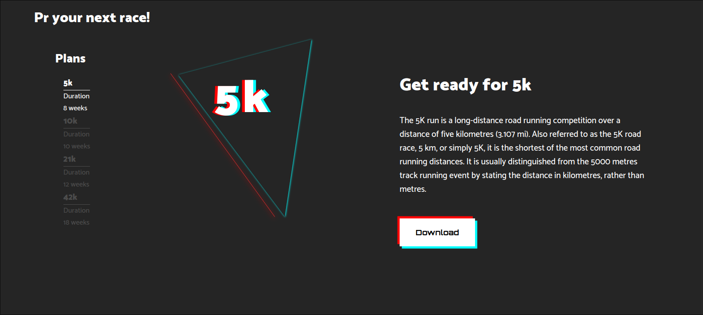

# Running Plan Downloader

## Overview

The Running Plan Downloader is a simple web application that enables users to download running plans using the Wikipedia API and Vanilla JavaScript. This project was created to explore the integration of web development concepts with an external API, providing a user-friendly interface for retrieving and downloading running plans.

## Features

- **Wikipedia API Integration:** Utilizes the Wikipedia API to fetch running plans dynamically.
  
- **Vanilla JavaScript:** The project is built using plain JavaScript without relying on external libraries or frameworks.

- **User-Friendly Interface:** Provides an intuitive and responsive web interface for users to easily browse and download running plans.

## What I Learned

- **API Integration:** Explored and implemented the integration of external APIs into a web application.

- **Vanilla JavaScript Skills:** Strengthened my understanding of JavaScript by building the project without relying on external frameworks or libraries.

- **DOM Manipulation:** Learned how to dynamically update and manipulate the Document Object Model (DOM) to provide a seamless user experience.

- **Responsive Design:** Implemented a responsive design to ensure a consistent and user-friendly experience across various devices.

## Acknowledgments

Special thanks to the Wikipedia API for providing a rich source of information on running plans and Nike running club for the free plans.

